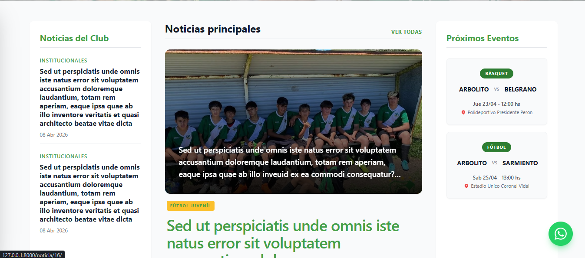
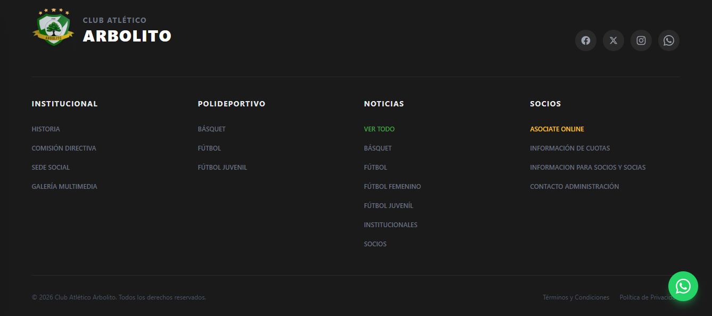

# ⚽ Club Atlético Arbolito - Portal Web Institucional

Plataforma web dinámica y responsiva desarrollada para la gestión institucional y deportiva del Club Atlético Arbolito. Diseñada para mantener a los socios informados, gestionar disciplinas y facilitar la asociación de nuevos miembros.


## 🚀 Características Principales

* **Gestión de Noticias:** Sistema de publicaciones con categorización, noticias destacadas en portada y paginación.
* **Sección Deportiva:** Perfiles por disciplina, galerías de imágenes filtradas, registro de últimos resultados y fixture de próximos eventos.
* **Gestión de Socios:** Formulario de pre-inscripción online con validación de datos y panel de contacto administrativo.
* **Diseño Moderno y Responsivo:** Interfaz construida con Tailwind CSS, garantizando una experiencia fluida tanto en dispositivos móviles (menú acordeón off-canvas) como en escritorio.
* **Panel de Administración:** Backend completo para que la Comisión Directiva gestione el carrusel de imágenes, noticias, deportes y solicitudes de forma intuitiva.

## 📸 Capturas de Pantalla

### Portada y Encabezado Dinámico


### Panel de Noticias y Eventos


### Footer Institucional


## 🛠️ Tecnologías Utilizadas

* **Backend:** Python, Django 5.x
* **Frontend:** HTML5, Tailwind CSS (vía CDN), JavaScript (Vanilla)
* **Base de Datos:** SQLite (Desarrollo) / PostgreSQL (Producción)
* **Arquitectura:** MVT (Model-View-Template)

## ⚙️ Instalación y Configuración Local

Si deseas correr este proyecto en tu entorno local, sigue estos pasos:

1. **Clonar el repositorio:**
   ```bash
   git clone [https://github.com/tu-usuario/club_arbolito.git](https://github.com/tu-usuario/club_arbolito.git)
   cd club_arbolito

2. **Crear y activar un entorno virtual:**
   python -m venv venv
   source venv/Scripts/activate  # En Windows
   # source venv/bin/activate    # En Linux/Mac

3. **Instalar dependencias:**
   pip install -r requirements.txt

4. **Aplicar las migraciones a la base de datos:**
   python manage.py makemigrations
   python manage.py migrate

5. **Crear un superusuario (para acceder al panel de administración):**
   python manage.py createsuperuser

6. **Ejecutar el servidor de desarrollo:**
   python manage.py runserver

## 👨‍💻 Autor

Desarrollado por **Emanuel Sequeira**.
* [LinkedIn](www.linkedin.com/in/emanuel-sequeria-a8360b231)
* [GitHub](https://github.com/Manuseq94)


